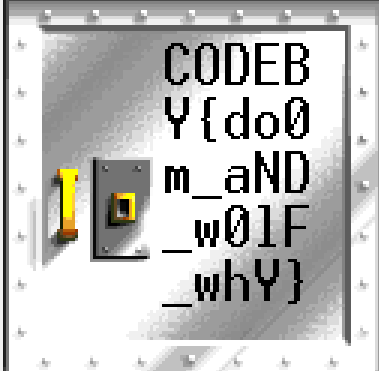

# 2023 writeup for Cybercoliseum by codeby.games
- https://codeby.games/

### Index
- Forensics:
    - [Dismissal](#dismissal)
    - [Old Fighter](#old-fighter)
    - [Hidden Trace](#hidden-trace)
- Web:
    - [magical admin](#magical-admin)
- Misc:
    - [Carousel](#carousel)
    - [rgb](#rgb)
    - [mathematician](#mathematician)

## Dismissal
- given is an sqlite database and you have to find the person who accessed every room in one day
- the solution was the name, card_id and timestamp
- it can be retrieved with following sql statements

```sql
# get card id by checking which card had the most rooms entered on a specific date:
select id, count(room) as rooms, card_id, in_room, date(time, 'unixepoch') as date from rooms_visits where date = "2022-09-01" group by card_id order by rooms;
# get card_key:
select *, date(time, "unixepoch") as date from card_keys where card_id = "9d1274" and date = "2022-09-01";
# get user:
select * from users where id = "12";
# get visits:
select *, date(time, "unixepoch") as date from visits where user_id = "12" and date = "2022-09-01";
```

## old fighter
- file is an wad file, which is an old plugin for the game doom
- open wad file in https://slade.mancubus.net/
- there is an image under resources with the flag



## hidden trace
- the file is an ext4 filesystem with deleted files in them which must be recovered
- use following command to recover ext4 data through file carving
foremost -d -T -v -i data

## carousel
solved with script carousel.py
- there are three different encodings used: binary ascii, ascii, base64 ascii
- with an simple python script those can be put together

```python
import base64

input = "1000111|72|ZQ==|1100001|74|IA==|1101010|6f|Yg==|101100|20|Yg==|1110101|64|ZA==|1111001|21|IA==|1000100|69|ZA==|100000|79|bw==|1110101|20|ZA==|1101111|20|aQ==|1110100|20|bQ==|1100001|6e|dQ==|1100001|6c|bA==|1111001|3f|IA==|1001001|6e|IA==|1110000|72|aQ==|1101110|63|aQ==|1110000|6c|ZQ==|100000|69|dA==|100000|64|bw==|1100101|73|bg==|100111|74|IA==|1101101|61|dA==|1110100|65|cg==|101110|20|Qw==|1101000|65|Yw==|1101011|20|bw==|1110101|74|IA==|1110100|68|ZQ==|100000|6c|aQ==|1101110|65|cw==|111010|20|TA==|1101111|72|ZQ==|1101101|20|aQ==|1110000|73|dQ==|1101101|20|ZA==|1101111|6c|bw==|1110010|20|cw==|1101001|74|IA==|1100001|6d|ZQ==|1110100|2c|IA==|1100011|6f|bg==|1110011|65|Yw==|1110100|65|dA==|1110101|72|IA==|1100001|64|aQ==|1110000|69|cw==|1100011|69|bg==|1100111|20|ZQ==|1101100|69|dA==|101100|20|cw==|1100101|64|IA==|1100100|6f|IA==|1100101|69|dQ==|1110011|6d|bw==|1100100|20|dA==|1100101|6d|cA==|1101111|72|IA==|1101001|6e|Yw==|1101001|64|aQ==|1100100|75|bg==|1110100|20|dQ==|1110100|20|bA==|1100001|62|bw==|1110010|65|IA==|1100101|74|IA==|1100100|6f|bA==|1101111|72|ZQ==|100000|6d|YQ==|1100111|6e|YQ==|100000|61|bA==|1101001|71|dQ==|1100001|2e|IA==|1010101|74|IA==|1100101|6e|aQ==|1101101|20|YQ==|1100100|20|bQ==|1101001|6e|aQ==|1101101|20|dg==|1100101|6e|aQ==|1100001|6d|LA==|100000|71|dQ==|1101001|73|IA==|1101110|6f|cw==|1110100|72|dQ==|1100100|20|ZQ==|1111000|65|cg==|1100011|69|dA==|1100001|74|aQ==|1101111|6e|IA==|1110101|6c|bA==|1100001|6d|Yw==|1101111|20|bA==|1100001|62|bw==|1110010|69|cw==|100000|6e|aQ==|1110011|69|IA==|1110101|74|IA==|1100001|6c|aQ==|1110001|75|aQ==|1110000|20|ZQ==|1111000|20|ZQ==|1100001|20|Yw==|1101111|6d|bQ==|1101111|64|bw==|100000|63|bw==|1101110|73|ZQ==|1110001|75|YQ==|1110100|2e|IA==|1000100|75|aQ==|1110011|20|YQ==|1110101|74|ZQ==|100000|69|cg==|1110101|72|ZQ==|100000|64|bw==|1101100|6f|cg==|100000|69|bg==|100000|72|ZQ==|1110000|72|ZQ==|1101000|65|bg==|1100100|65|cg==|1101001|74|IA==|1101001|6e|IA==|1110110|6f|bA==|1110101|70|dA==|1100001|74|ZQ==|100000|76|ZQ==|1101100|69|dA==|100000|65|cw==|1110011|65|IA==|1100011|69|bA==|1101100|75|bQ==|100000|64|bw==|1101100|6f|cg==|1100101|20|ZQ==|1110101|20|Zg==|1110101|67|aQ==|1100001|74|IA==|1101110|75|bA==|1101100|61|IA==|1110000|61|cg==|1101001|61|dA==|1110101|72|Lg==|100000|45|eA==|1100011|65|cA==|1110100|65|dQ==|1110010|20|cw==|1101001|6e|dA==|100000|6f|Yw==|1100011|61|ZQ==|1100011|61|dA==|100000|63|dQ==|1110000|69|ZA==|1100001|74|YQ==|1110100|20|bg==|1101111|6e|IA==|1110000|72|bw==|1101001|64|ZQ==|1101110|74|LA==|100000|73|dQ==|1101110|74|IA==|1101001|6e|IA==|1100011|75|bA==|1110000|61|IA==|1110001|75|aQ==|100000|6f|Zg==|1100110|69|Yw==|1101001|61|IA==|1100100|65|cw==|1100101|72|dQ==|1101110|74|IA==|1101101|6f|bA==|1101100|69|dA==|100000|61|bg==|1101001|6d|IA==|1101001|64|IA==|1100101|73|dA==|100000|6c|YQ==|1100010|6f|cg==|1110101|6d|Lg==|100000|54|YQ==|1101011|65|IA==|1111001|6f|dQ==|1110010|20|Zg==|1101100|61|Zw==|100000|2d|IA==|1000011|4f|RA==|1000101|42|WQ==|1111011|62|aQ==|1101110|34|cg==|1111001|5f|aA==|110011|78|Xw==|1100001|6e|ZA==|1011111|62|NA==|1110011|33|fQ==|101110|20|VA==|1101000|61|bg==|1101011|73|IA==|1100110|6f|cg==|100000|70|YQ==|1110011|73|aQ==|1101110|67|IA==|1100001|6e|ZA==|100000|67|bw==|1101111|64|IA==|1101100|75|Yw==|1101011|20|aQ==|1101110|20|dA==|1101000|65|IA==|1101110|65|eA==|1110100|20|dA==|1100001|73|aw==|1110011|2e"

input_array = input.split("|")

def is_base64_encoded(s):
    try:
        # Attempt to decode the string
        decoded_bytes = base64.b64decode(s)
        # If successful, return True
        return True
    except base64.binascii.Error:
        # If decoding fails, return False
        return False

for i in range(0, len(input_array)):
    str1 = input_array[i].strip()

    if is_base64_encoded(str1):
        decoded = base64.b64decode(str1).decode("utf-8")
        print(decoded, end="")
    elif len(str1) > 5:
        str1 = int(str1, 2)
        decoded = chr(str1)
        print(decoded, end="")
    else:
        str1 = int(str1, 16)
        decoded = chr(str1)
        print(decoded, end="")
```

## rgb
solved with script rgb.py, then use aperisolve with an blue filter to read the flag out of the image
```python
from PIL import Image

image = Image.new("RGB", (1280, 853), (255, 255, 255))

with open("1280x853.txt", "r") as f:
    for line in f:
        # Find the position of the opening and closing parentheses
        line = line.strip()
        line = line.replace("):", ",")
        line = line.replace("(", "")

        values = line.split(", ")

        # Draw the pixel on the image
        image.putpixel((int(values[0]), int(values[1])), (int(values[2]), int(values[3]), int(values[4])))
        
image.save("output.png")  # Save the image as a file
image.show()  # Display the image using the default image viewer
```


## Magical admin
instructions: Everyone tells me not to leave passwords in the code, someone can see them. "Blah blah blah blah" is what I hear. To prove to everyone that my application is safe, I put it in open access, no one can break it.

the double hashed md5 hash used in the magical_admin.php backend is "0e385589729688144363378792916561" which equals in scientifc notation 0 (because of the "0e" prefix and only numbers in the hash - means: 0 * e^385589729688144363378792916561). So you have to find an password that also, when hashed twice with the md5 hash equals 0. 

here an simple php script that will find such a hash/ password:
```php
<?php

$pw = '0e385589729688144363378792916561';  // the double hashed password

for ($i = 1; $i <= 9999999999; $i++) {
        $key_hash = md5(md5(trim($i)));
        if ($key_hash == $pw){
                echo "found collision: " . $i;
        }
}

// result:
// found collision: 179122048

?>
```

## mathematician
- given is an tcp socket (netcat) which provides 50 mathematic equations display behind each other which must be solved in five seconds.
- You solve it with an script that puts the input in an equation solving function and sends the result back within five seconds.
```python
import socket
import time
from sympy import symbols, Eq, solve

# Server configuration
host = '62.173.140.174'  # Localhost
port = 39001  # Port to bind to

# Create a socket object
s = socket.socket(socket.AF_INET, socket.SOCK_STREAM)

# Connect to the server
s.connect((host, port))

# start the game
s.sendall(b'start\n')

while True:
    response = s.recv(2048).decode().strip()
    lines_array = response.splitlines()
    print(response)

    for line in reversed(lines_array):
        if '=' in line:
            line = line.strip()

            print("line: " + line)

            brace_index = line.find('(')
            print("equation: " + line[brace_index+1])
            equal_index = line.find('=')

            close_brace_index = line.find(')')
            equation1 = line[close_brace_index+1:equal_index].strip()
            print("equation1: " + equation1)
            equation2 = line[equal_index+1:].strip()
            print("equation2: " + equation2)

            if 'x' in equation1:
                x = symbols('x')
                equation = Eq(eval(equation1), int(equation2))
                solution = solve(equation, x)
                print("solution: " + str(equation) +" = " + str(solution[0]))
            elif 'y' in equation1:
                y = symbols('y')
                equation = Eq(eval(equation1), int(equation2))
                solution = solve(equation, y)
                print("solution: " + str(equation) +" = " + str(solution[0]))

            send = str(solution[0]) + '\n'
            s.sendall(send.encode('utf-8'))
            time.sleep(1)
    time.sleep(1)

s.close() # Close the connection
```

## resources
- https://github.com/spaze/hashes/
- https://security.stackexchange.com/questions/238043/magic-hash-attack-in-javascript
- https://aperisolve.com/
