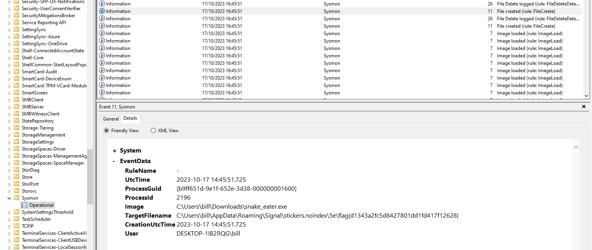

# snake eater

## instructions

Hey Analyst, I've never seen an executable icon that looks like this. I don't like things I'm not familiar with. Can you check it out and see what it's doing?
Archive password: infected

## solve 

binary can be executed with arguments, you will get some nice graphics but that is a dead end.
install and run sysmon with very verbose config:
- https://learn.microsoft.com/en-us/sysinternals/downloads/sysmon
- https://github.com/olafhartong/sysmon-modular

execute binary and search for created files in the sysmon log

