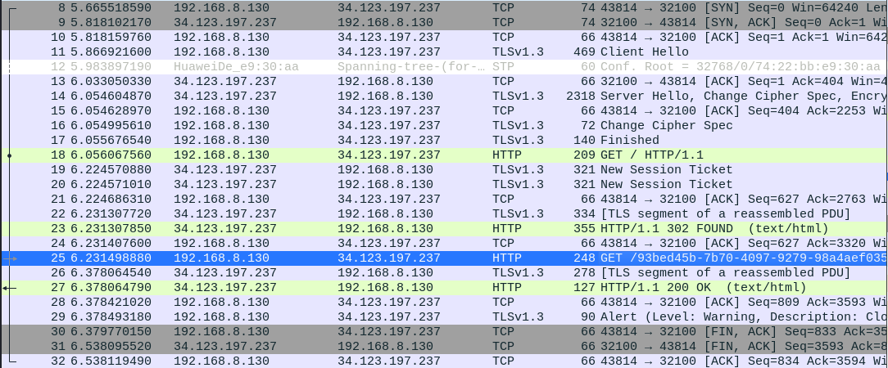

# speakfriend

## instructions

It seems like this website was compromised. We found this file that seems to be related... can you make any sense of these and uncover a flag?

NOTE:
Archive password is infected
You will need access this service with HTTPS. Please use https:// as the URL schema rather than plain http://.
This website uses a self-signed certificate. The "Warning: connection not secure" message is expected and intended. You can continue on to the website.
This challenge is based off of a real malware sample. We have done our best to "defang" the code, but out of abundance of caution it is strongly encouraged you only analyze this inside of a virtual environment separate from any production devices.

## how to solve

when extracting strings from elf binary (main) you notice that curl libraries get loaded, which means the executable wants to talk to someone. 

when you give it the given host you will notice in wireshark that it is sending tls http traffic back and fourth with it:
```bash
./main http://chal.ctf.games:32580
```



to view the decrypted TLS traffic set the $SSLKEYLOGFILE environment variable to a file where the private keys should be stored
```bash
touch /home/kali/key.txt
export SSLKEYLOGFILE=/home/kali/key.txt
```

then in wireshark go to "Edit -> Preferences -> RSA Keys -> Add new keyfile" and select the just created file. now the traffic is decrypted and viewable.


## resources
https://wiki.wireshark.org/TLS